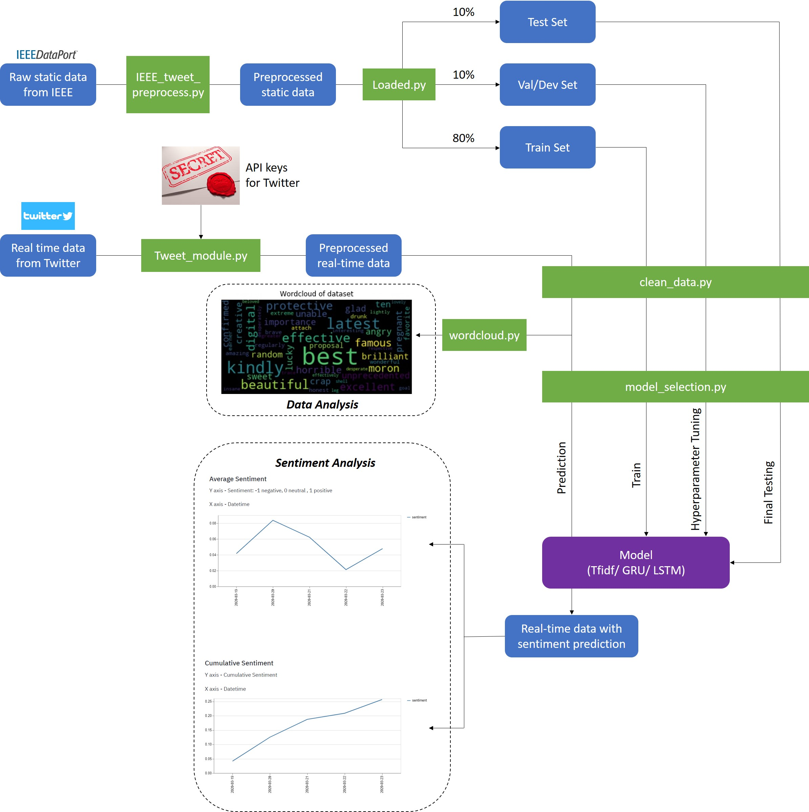
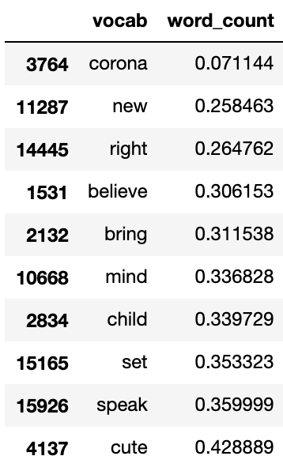
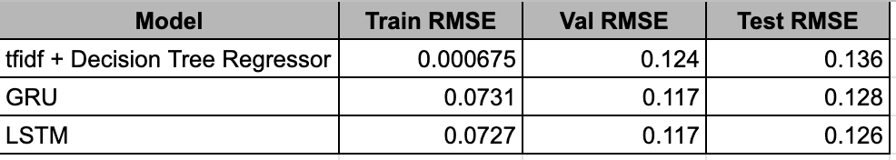

# Introduction

Unless you are living in a cave (hopefully without bats), you must have heard about the COVID-19 situation. COVID-19 is a coronavirus belonging to the same family as the virus that caused SARS in 2003, and COVID-12 (otherwise known as MERS, but applying the same logic as the naming of COVID-19, we shall propose to call it COVID-12 to remove social stigma associated to it) in 2012. COVID-19 mainly infects the type II alveolar cells (a type of lung cell) by targeting the ACE2 membrane-bound enzyme. Common symptoms include (but not limited to) coughing, sore throat, muscle pain, fatigue, and loss of smell. While most cases only presented mild symptoms, some patients progressed to more severe symptoms like pneumonia, multi-organ failure, and even death. (If you wish to know more, feel free to contact your friendly neighborhood biologist, Simon) 
 
As compared to its two predecessors (SARS and COVID-12), COVID-19 was more infectious, which resulted in more people (almost everyone) paying attention to it, and the sentiment of the public is greatly affected by it.  
 
Sentiment analysis is the process of computationally identifying and categorizing opinions expressed in a piece of text, especially in order to determine whether the writer's attitude towards a particular topic. Twitter and Facebook posts are common data source for people to collect and perform sentiment analysis.  

In this web app, we will be utilising Twitter as our datasource.

# What this web app does?
This web app allows you to perform sentiment analysis on recent tweets about the COVID-19 in Singapore (or just COVID-19 in general). 

To use the app, follow the following steps:  
0. Select the model from the side-bar
1. Go to <b>Twitter Data Generator</b>, type in your keywords, and click 'Generate csv'.  
2. Select the csv file from the side-bar and load it (click Load csv)
3. Go to <b>Data Analysis</b> to generate the word cloud for the dataset
4. Go to <b> Sentiment Analysis</b> to study the trend in the sentiment.
# Possible Use case
Government could use this web app to get assess public sentiment before/after they implemented some policy, so that they could get some sort of feedback from the public.  
The word cloud under <b>Data Analysis</b> also allowed them to have an overview about what people are talking about regarding the issue.  

# Under the hood

## 5 out more about the Data pipeline

### Training datasource (Static data)
The training data was submitted by [Rabindra Lamsal][1] to the IEEE DataPort. The data contains tweets ID, and their respective sentiment score (generated by the Rabindra Lamsal).  
The tweet data were then downloaded using the [DocNow's Hydrator application][2]. The data was then preprocessed to extract the relevant data.  

### Preprocessing (Static data)
The static data was in string format. In order to extract the tweets, the data was first split into separate tweets by spliting by new lines ('\n')  
Next, the date, text, and tweet id were extracted for each tweet using the regex. These data were then fed into a pandas dataframe (df_tweet).  
Finally, the sentiment score (df_sentiment) for each tweet were added by performing an inner join between the df_sentiment and df_tweet.  

### Real-time data from Twitter (Real-time)

The real-time Twitter data were obtained via the Twitter API via the [Tweepy package][3]. The query from the <b>Twitter Data Generator</b> will then be used fetch the recent tweets based on the query.

### Data cleaning pipeline
The data from both static and real-time data pass through the same data cleaning pipeline.  
The data cleaning pipeline will performs the following function:

- Remove username
- Remove emoticon
- Remove url
- Remove html
- Remove stopwords
- Perform lemmatisation
- Remove unknown words (including acronyms)
- Remove tweets that are shorter than minimum length
- Remove duplicated rows (based on the tweet text)
- Convert the created_date to date_time format

## 5 out more about the Models
In this project, we have trained 3 different models: 

- TFIDF + Decision Tree
- Gated Recurrent Units (GRU)
- Long Short Term Memory (LSTM)

### 1. TFIDF + Decision Tree
##### TF-IDF 

Term Frequency -  Inverse Document Frequency (TF-IDF) is a popular method used in information retrieval and text mining purposes. The weight resulting in this method evaluates the importance of a word in a text. Traditionally, the higher the frequency, the more important a word is. However, this proves problem when stopwords/filler words are taken into account. The IDF portion will then be used to penalise this importance by log inversing the TF weights. 

The tweets were being fed into a sklearn [TfidfVectorizer][4]. This will return a matrix of TF-IDF features.   
The image below shows the weights of the first 10 features of the train data set. (Words with 0.0 are filtered off) 

##### Decision Tree Regressor
The TF-IDF features were then used to train a [Decision Tree Regressor][5] to predict the sentiment score of the tweets.  
The parameters of the Decision Tree Regressor used are the default parameters. 

### LSTM
The tweets were being tokenised using the tensorflow [Tokenizer][6]. The tokenizer will transform each text in the texts into a sequence of integers (texts_to_sequences), which were padded/truncated to the sequence length 9, before passing to a [LSTM model][7] to predict the sentiment score of the tweets.  
The parameters of the LSTM model are as follow: 

- activation function: Adam
- loss function: mean squared error
- batch size: 512
- epochs: 10 (early stop at epoch 8)
- units: 32

### GRU
The preprocessing of data for the GRU model is similar to LSTM, where we tokenised the tweets using the tensorflow [Tokenizer][6], before feeding to the [GRU model][8].  
The parameters of the GRU model are as follow: 

- activation function: Adam
- loss function: mean squared error
- batch size: 512
- epochs: 10 (early stop at epoch 8)
- units: 32

The image below shows the root mean squared error(RMSE) for the different models: 

## 5 out more about the User Interface
The web app was designed using [streamlit][9]. 

There are 5 tools available in this web app. 
- Sentiment Analysis
- Data Analysis
- Sentiment Generator
- Model Analysis
- Project Architecture 

### Sentiment Analysis
The sentiment analysis tool allows you to perform sentiment analysis (like duh...) on the loaded twitter dataset. There are three filters available for you to customise the output of the tool. You can choose to display the details of the graph by selecting the **display by** drop box (Date/Hours/Seconds). You can also select the range of date by selecting the **start datetime** and **end datetime**.

Two graphs will be displayed in this tool: 
- Average Sentiment: This graph shows the average sentiment over the selected time period.
- Cumulative Sentiment: This graph shows the cumulative (Summation from the first time point)
 sentiment.

### Data Analysis
This tool shows two word cloud, which we have generated during our EDA. The two word clouds shows the words associated with positive sentiment tweets and negative sentiment tweets respectively.  
At the bottom of the page, the generate word cloud for the selected dataframe, so that you can have a high level overview of the sentiment in your selected dataframe.

 ### Sentiment Generator
 The sentiment generator allows you to perform a search on twitter using the search term in **Enter targeted keywords**. You can also select the country/cities of interest. It will then return an csv file containing the twitter data, which you could perform analysis with out tools.

 ### Model Analysis
 This page allows you to explore more information regarding our models.

 ### Project Architecture
 This page give you an overview of our project architecture.

<!-- Reference links -->
[1]: https://rlamsal.com.np/
[2]: https://github.com/DocNow/hydrator
[3]: https://www.tweepy.org/
[4]: https://scikit-learn.org/stable/modules/generated/sklearn.feature_extraction.text.TfidfVectorizer.html
[5]: https://scikit-learn.org/stable/modules/generated/sklearn.tree.DecisionTreeRegressor.html
[6]: https://www.tensorflow.org/api_docs/python/tf/keras/preprocessing/text/Tokenizer
[7]: https://www.tensorflow.org/api_docs/python/tf/keras/layers/LSTM
[8]: https://www.tensorflow.org/api_docs/python/tf/keras/layers/GRU
[9]: https://www.streamlit.io/